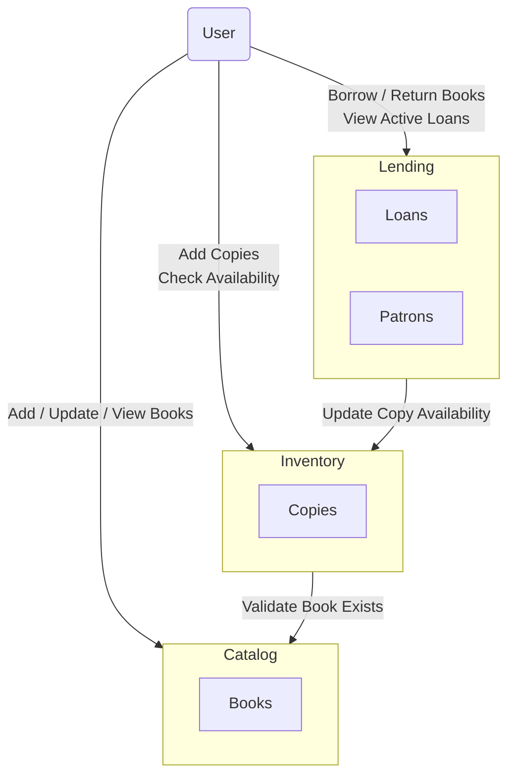
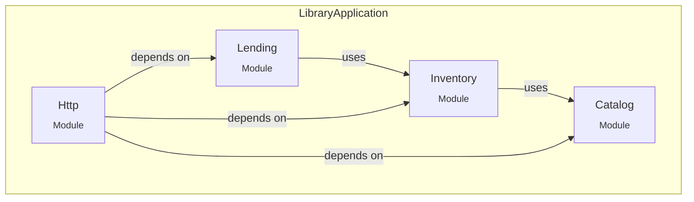

# Spring Modulith Demo

This project is a minimal, self-contained example of using Spring Modulith to evolve a classic monolithic
application into a modular monolith; a design that can later be split into microservices.

*This README is evolving alongside the code, so if you are looking at an older commit, you may not see the complete
version.
If you want to see the latest version of this README look at the HEAD commit on `main`*

### Helpful Resources for Understanding Modular Monoliths

- [AppContinuum](https://www.appcontinuum.io)
- [Monolith To Microservices](https://samnewman.io/books/monolith-to-microservices/)
- [Monolith First](https://martinfowler.com/bliki/MonolithFirst.html)

## Overview

The application in this repository demonstrates the modular monolith evolution step-by-step, using Git tags to mark the
key milestones.
Spring Boot and Spring Modulith are used as implementation tools, though the principles apply to other languages
and frameworks.

### Tags

For the *why* behind these steps, refer to the [AppContinuum](https://www.appcontinuum.io) for a more extensive
write-up.

- `v1-functional-groups` - Application organized into groups representing functionality.
  While this is a common pattern in many frameworks and applications,
  in my experience it tends not to evolve well and often leads to tight coupling and costly changes.

- `v2-bounded-contexts` - Application organized into groups
  representing [bounded contexts](https://martinfowler.com/bliki/BoundedContext.html) (also known as Feature Groups).
  This approach provides the necessary isolation to establish clear boundaries for discrete components.
  Simply reorganizing the code this way often reveals coupling issues.
  The package-based approach makes adjusting boundaries straightforward and balances
  flexibility with structure, especially in domains that are still evolving and require further discovery.
  For some applications, this represents an appropriate final architecture, though it ultimately depends on domain
  complexity and scaling needs.

### 🗺️ Domain



### Modules



## Using the Application

### Starting

#### Prerequisites

- Java 21 (or newer)

#### Run the application

```bash
./mvnw spring-boot:run
```

The service starts at <http://localhost:8080>.

#### API documentation

Once the application is running you can explore the REST endpoints via Swagger / OpenAPI:

* Swagger UI – <http://localhost:8080/swagger-ui.html>
* Raw OpenAPI spec – <http://localhost:8080/v3/api-docs>

#### Run the tests

```bash
./mvnw test
```

### Curl Examples

*All commands assume the app is running locally on port 8080; adjust as needed.*

If preferred, you can use [Swagger](http://localhost:8080/swagger-ui.html) to execute the commands.

#### 📚 Catalog API

##### 1. Add a new book

```bash
curl -i -X POST http://localhost:8080/catalog/books \
     -H 'Content-Type: application/json' \
     -d '{"isbn":"9780836218657","title":"The Essential Calvin and Hobbes","author":"Bill Watterson"}'
```

• HTTP 201 Created, *Location* header set to `/catalog/books/9780836218657`.

##### 2. Retrieve a book

```bash
curl -i http://localhost:8080/catalog/books/9780836218657
```

• HTTP 200 with the JSON payload.

##### 3. Update a book

```bash
curl -i -X PATCH http://localhost:8080/catalog/books/9780836218657 \
     -H 'Content-Type: application/json' \
     -d '{"isbn":"9780836218657","title":"The Essential Calvin and Hobbes","author":"William B. Watterson II"}'
```

• HTTP 204 No Content on success.

#### 📦 Inventory API

##### 1. Add a copy of a book

```bash
curl -i -X POST http://localhost:8080/inventory/copies \
     -H 'Content-Type: application/json' \
     -d '{"isbn":"9780836218657","location":"Main Library"}'
```

• HTTP 201 Created, *Location* header contains `/inventory/copies/{copyId}` with the generated numeric id.

##### 2. Check availability

```bash
curl -i http://localhost:8080/inventory/books/9780836218657/availability
```

• HTTP 200 with a payload like `{"available":1}`.

#### 🔄 Lending API

##### 1. Create a patron

```bash
curl -i -X POST http://localhost:8080/lending/patrons \
     -H 'Content-Type: application/json' \
     -d '{"firstName":"Susie","lastName":"Derkins"}'
```

• HTTP 201 Created, *Location* header set to `/lending/patrons/{patronId}`.

##### 2. Borrow a book

```bash
curl -i -X POST http://localhost:8080/lending/loans \
     -H 'Content-Type: application/json' \
     -d '{"patronId":1,"isbn":"9780836218657"}'
```

• HTTP 201 Created, *Location* header set to `/lending/loans/{loanId}`.

##### 3. Return a book

```bash
curl -i -X POST http://localhost:8080/lending/returns \
     -H 'Content-Type: application/json' \
     -d '{"patronId":1,"isbn":"9780836218657"}'
```

• HTTP 204 No Content on success.

##### 4. List active loans for a patron

```bash
curl -i http://localhost:8080/lending/patrons/1/loans
```

• HTTP 200 with a JSON array of the patron’s open loans.
