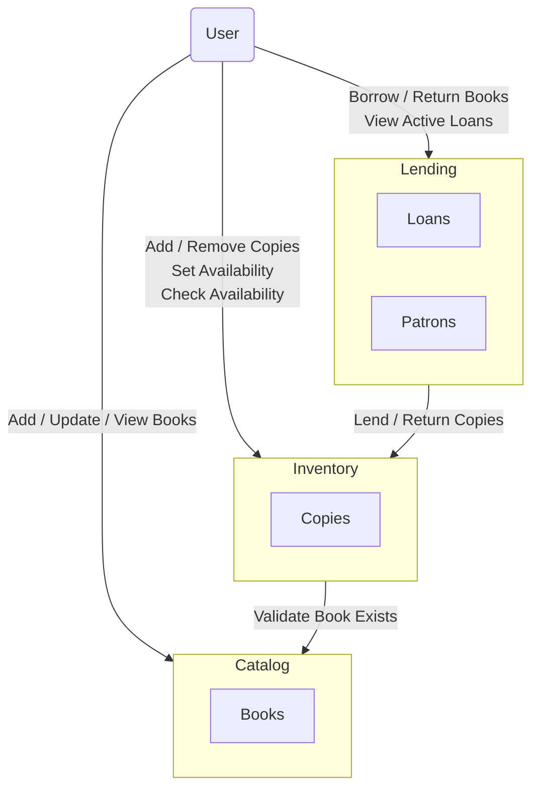

# Spring Modulith Demo

This project is a minimal, self-contained example of using Spring Modulith to evolve a classic monolithic
application into a modular monolith; a design that can later be split into microservices.

*This README is evolving alongside the code, so if you are looking at an older commit, you may not see the complete
version.
If you want to see the latest version of this README look at the HEAD commit on `main`*

### Helpful Resources for Understanding Modular Monoliths

- [AppContinuum](https://www.appcontinuum.io)
- [Monolith To Microservices](https://samnewman.io/books/monolith-to-microservices/)
- [Monolith First](https://martinfowler.com/bliki/MonolithFirst.html)

## Overview

The application in this repository demonstrates the modular monolith evolution step-by-step, using Git tags to mark the
key milestones.
Spring Boot and Spring Modulith are used as implementation tools, though the principles apply to other languages
and frameworks.

### 🗺️ Domain



## Using the Application

### Starting

#### Prerequisites

- Java 21 (or newer)

#### Run the application

```bash
./mvnw spring-boot:run
```

The service starts at <http://localhost:8080>.

#### Run the tests

```bash
./mvnw test
```

### Curl Examples

#### 📚 Catalog API

##### 1. Add a new book

```bash
curl -i -X POST http://localhost:8080/catalog/books \
     -H 'Content-Type: application/json' \
     -d '{"isbn":"9780132350884","title":"Clean Code","author":"Robert C. Martin"}'
```

• HTTP 201 Created, *Location* header set to `/catalog/books/9780132350884`.

##### 2. Retrieve a book

```bash
curl -i http://localhost:8080/catalog/books/9780132350884
```

• HTTP 200 with the JSON payload.

##### 3. Update a book

```bash
curl -i -X PATCH http://localhost:8080/catalog/books/9780132350884 \
     -H 'Content-Type: application/json' \
     -d '{"isbn":"9780132350884","title":"Cleaner Code","author":"Bob Martin"}'
```

• HTTP 204 No Content on success.

The commands assume the app is running locally on port 8080; adjust as needed.

#### 📦 Inventory API

##### 1. Add a copy of a book

```bash
curl -i -X POST http://localhost:8080/inventory/copies \
     -H 'Content-Type: application/json' \
     -d '{"isbn":"9781416928171","location":"Main Library"}'
```

• HTTP 201 Created, *Location* header contains `/inventory/copies/{copyId}` with the generated numeric id.

##### 2. Check availability

```bash
curl -i http://localhost:8080/inventory/books/9781416928171/availability
```

• HTTP 200 with a payload like `{"available":1}`.

##### 3. Remove a copy

```bash
curl -i -X DELETE http://localhost:8080/inventory/copies/{copyId}
```

• HTTP 204 No Content on success.

> Replace `{copyId}` with the id returned in step 1.

#### 🔄 Lending API

##### 1. Borrow a book

```bash
curl -i -X POST http://localhost:8080/lending/loans \
     -H 'Content-Type: application/json' \
     -d '{"patronId":1,"isbn":"9781416928171"}'
```

• HTTP 201 Created, *Location* header set to `/lending/loans/{loanId}`.

##### 2. Return a book

```bash
curl -i -X POST http://localhost:8080/lending/returns \
     -H 'Content-Type: application/json' \
     -d '{"patronId":1,"isbn":"9781416928171"}'
```

• HTTP 204 No Content on success.

##### 3. List active loans for a patron

```bash
curl -i http://localhost:8080/lending/patrons/1/loans
```

• HTTP 200 with a JSON array of the patron’s open loans.
