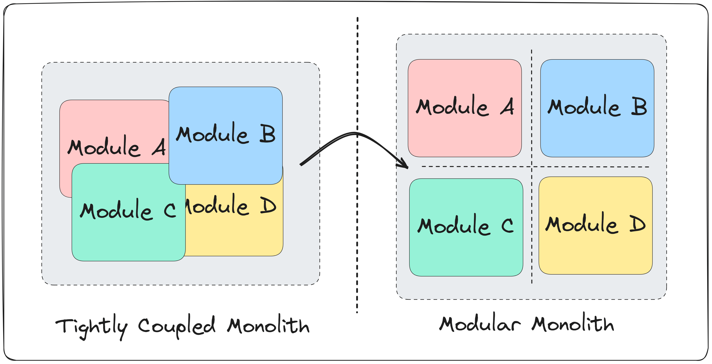

[//]: # (© 2025 by James McMahon. All Rights Reserved.)
[//]: # (run using `marp slide-deck.md -o slides.html --html --allow-local-files -w`)

# Evolve Your Codebase Using Spring Modulith

https://github.com/JamesMcMahon/spring-boot-demo-modulith/

---

# Monoliths are great!

- Simple
- Easy to change
- Easy to deploy

---

# Monoliths are terrible!

- Scaling is challenging
- Requires discipline to keep from becoming a big ball of mud
- Requires EVEN MORE discipline when working with multiple teams

---

# Microservices are great!

- Can scale independently
- Can deploy independently
- Encapsulated domains for teams to work on independently

---

# Microservices are terrible!

- A lot of complexity
- Deployment can be difficult
- Difficult to change
- If you had wrong assumptions about your domain, they are now encoded in the design of the services

---

# Modular Monolith

- Middle ground
- Encapsulate domains to make working with multiple teams easier
- Easier to change



---

## Common Pattern

```
Monolith → Modular Monolith → Microservices
```

As we move to the right, changes become harder but design is more enforceable.

---

# No "one size fits all" answer

- Architecture choices depend on your specific products and teams
- Starting with a monolith might be perfect for one situation but not work for others
- The same applies to microservices—they're not always the best choice
- Different teams may start and stop at different places along the architecture spectrum

---

# Modular Monolith Resources

- AppContinuum - https://www.appcontinuum.io
- Monolith To Microservices - https://samnewman.io/books/monolith-to-microservices/
- Monolith First - https://martinfowler.com/bliki/MonolithFirst.html

---

# Spring Modulith

- A tool for creating modular monoliths with boundaries that are easy to evolve

<div class="columns">
<div>

## Pros

- Easier to change boundaries compared to full Gradle / Maven modules
- Lower overhead for architectural experimentation

</div>
<div>

## Cons

- Boundaries between modules are enforced by tests, not the compiler

</div>
</div>

---

# Library Demo App

https://github.com/JamesMcMahon/spring-boot-demo-modulith/

[//]: # (Graph from main HEAD README)

<p>
<marp-auto-scaling data-downscale-only>

</marp-auto-scaling>
</p>

---

# Library Demo App

Tags:

- v1-functional-groups
- v2-bounded-contexts
- v3-spring-modules
- v4-decoupled-modules

---

# Functional Groups

Grouped by function, ie,

```
controllers/
data/
model/
services/
```

---

# Functional Groups

<div class="columns">
<div>

## Pros

- Easy, doesn't require a lot of up front thinking

</div>
<div>

## Cons

- Leads to coupling and makes encapsulation difficult

</div>
</div>

---

# Bounded Context

Group by feature / domain

<div class="columns">
<div>

## Functional

```
controllers/
    CatalogController.java
data/
    BookRepository.java
model/
    Book.java
services/
    Catalog.java
```

</div>

<div>

## Bounded Context

```
catalog/
    Book.java
    BookRepository.java
    Catalog.java
    CatalogController.java
http/
inventory/
lending/
```

</div>
</div>

---

# Bounded Context

<div class="columns">
<div>

## Pros

- Moves the codebase towards encapsulation
- Easy to change as the codebase evolves

</div>
<div>

## Cons

- Requires making explicit design choices
- Need to put in the work and start to decouple
- Requires lots of communication and discipline within the team to maintain

</div>
</div>

---

# Spring Modulith Modules

- Same structure as the Bounded Context approach
- Addition of `package-info.java` to establish explicit dependencies

```java
@ApplicationModule(
        displayName = "Inventory",
        allowedDependencies = "catalog"
)
package sh.jfm.springbootdemos.modulith.inventory;
```

See https://github.com/JamesMcMahon/spring-boot-demo-modulith/commit/643f812bb430f92e7138032a67cfb0dc1e47e9bf

---

# Spring Modules Graph

[//]: # (Graph from v3-spring-modules)

A nice feature of Spring Modulith is automatic graph generation.
See `ModuleDocumentationTests` for implementation details.

<p>
<marp-auto-scaling data-downscale-only>

</marp-auto-scaling>
</p>

---

# Decouple Modules

- We have modules, but they are directly dependent on each other
- Let's decouple so they don't directly call each other
- Thinking about these boundaries is essential for the move to Microservices
- Still very useful even if you don't move to Microservices as encapsulated modules are easier to modify

---

# HTTP

- Let's get rid of the HTTP module
- Split exceptions into each domain
- Probably would have been a better initial design but became more obvious now that we have enforced boundaries

---

# Intermodule Communication

- Book Added
- Copy Borrowed
- Copy Returned

---

# Lending - Copy Returned

- System sends an event when a book is returned
- This is an ideal use case for eventual consistency
- Inventory listens for this event and increases availability atomically

---

# Aside: Application Events

Spring can use events entirely locally, avoiding the need for external brokers.

- `ApplicationEventPublisher` - used to send events
- ` @EventListener` - makes a component listen to events
- `ApplicationEvent` - optional class to extend for an event

See:
https://github.com/JamesMcMahon/ApplicationEventDemo

---

# Catalog - Book Added

- Instead of direct availability checks against Catalog:
    - Catalog now sends an event when books are created
    - Inventory listens for this event and tracks the ISBNs
- This approach is more complex, duplicates data, and is harder to follow
- However, it achieves decoupling—a valuable trade-off for maintainability

---

# Lending - Copy Borrowed

- Challenging scenario because eventual consistency isn't appropriate
- A direct call is perfect, as we need this to be atomic so other folks don't borrow the same copy
- We can maintain decoupling while preserving atomicity:

```java 
// By introducing this interface, any implementation on the classpath will be automatically wired at runtime.
public interface InventoryApi {
    Optional<Long> markNextCopyAsUnavailable(String isbn);
}
```

---

# Decoupled Modules

[//]: # (Graph from v4-decoupled-modules)

<p>
<marp-auto-scaling data-downscale-only>

</marp-auto-scaling>
</p>

---

<style scoped>section{font-size:32px;}</style>

# Next Steps

If we decided to move to a full microservice architecture:

- Implement an external event bus (e.g., RabbitMQ or Kafka)
- Split into Gradle/Maven modules (feasible now that we've identified clear boundaries)
- Use HTTP for atomic borrow operation
  - Can use Spring's `@HttpExchange` to implement HTTP Client automatically
- Separate into multiple independently deployable applications
- Divide into multiple databases (easier with separate Spring applications)

---

# Summary

Spring Modulith is a tool that helps you:

- Identify boundaries between domains at low cost
- Enforce these boundaries as your team works together
- Evolve your architecture incrementally

It's particularly valuable during the knowledge discovery phase and application growth.

```
Monolith → Package-Based Modules → Spring Modulith → Gradle/Maven Modules → Microservices
```